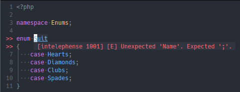

[coc-phpls](https://github.com/marlonfan/coc-phpls) を入れている環境で Enum を定義しようとすると `[intelephense 1001] [E] Unexpected 'Name'. Expected ';'.` というエラーが出た。



## 原因と解決方法

[現行の Intelephense のターゲットの PHP バージョンのデフォルトが 7.4.0](https://github.com/bmewburn/intelephense-docs/blob/3e810bc2823754096710863d2d0c30382c0bee55/installation.md?plain=1#L480) だった。

`:CocConfig` で設定ファイルを開いて

```json
"intelephense.environment.phpVersion": "8.1.0",
```

を追加してやれば良い。
